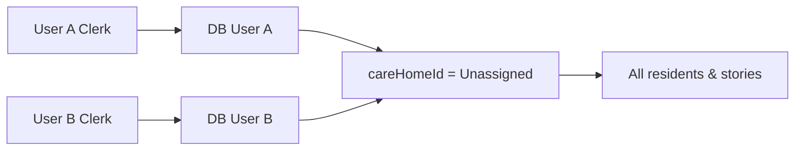
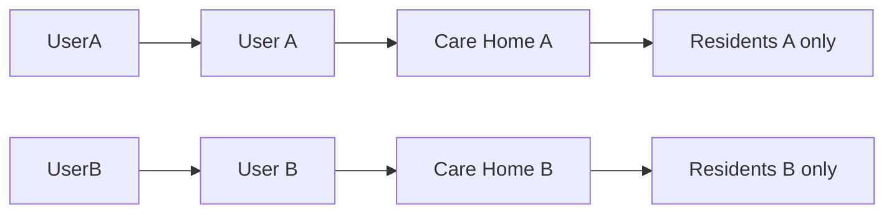

# Plan: Fix shared data between accounts (multi-tenancy)

## Root cause (confirmed)

The API **already filters** by `req.user.careHomeId` on every route. The bug is **not** missing checks in `residents.ts` / `stories.ts`.

The bug is in **`server/src/middleware/auth.ts`**:

When a new Clerk user signs in for the first time, the code does:

```ts
let defaultCareHome = await prisma.careHome.findFirst({
  where: { name: "Unassigned" },
});
// ... every new user gets careHomeId: defaultCareHome.id
```

**All accounts are attached to the same care home** → same residents, same stories.

Demo seed data (`prisma/seed.ts`) also puts sample residents in that same **"Unassigned"** home → every new user sees demo books **plus** other users' data.



## What “correct” looks like



Each Clerk account → one `User` row → **one private `CareHome`** → residents/stories scoped by `careHomeId`.

---

## Fix plan (phases)

### Phase 1  Stop the bleeding (required) ✅ Done

| Task | File | Action |
|------|------|--------|
| 1.1 | `auth.ts` | On first login, **create a new `CareHome` per user** (e.g. `دار {fullName}`), do **not** reuse `"Unassigned"` |
| 1.2 | `seed.ts` | Put demo residents in **`Wanis Demo`** care home, link only to seed admin user |
| 1.3 |  | New signups get **empty library** (their own home) |

### Phase 2  Repair existing production data (run once) ✅ Script: `npm run migrate:tenants`

| Task | Action |
|------|--------|
| 2.1 | Script `prisma/migrate-tenants.ts` | For each user still on shared home: create personal `CareHome`, update `user.careHomeId` |
| 2.2 | Reassign residents | Move each resident to the care home of the user who **first recorded a story** for that resident |
| 2.3 | Demo data | Keep sample residents on **Wanis Demo**; only `admin@wanis.app` (or no real users) stays attached to demo |

### Phase 3  Hardening (recommended) ✅ Partial

| Task | Action | Status |
|------|--------|--------|
| 3.1 | `Resident.createdById` | Who created the resident | ✅ Done |
| 3.2 | Onboarding UI | First login: “اسم دار الرعاية” modal | ✅ Done |
| 3.3 | `GET/PATCH /api/me` | Profile + care home setup | ✅ Done |
| 3.4 | Invite model (later) | Staff join same home via invite code | Not started |
| 3.5 | Audit tests | Two Clerk users isolation test | Not started |

### Phase 4  Clerk / orgs (optional, later)

Use Clerk Organizations so one care facility = one org, many staff accounts share **one** home **intentionally**.

---

## Files to change

| File | Phase |
|------|-------|
| `server/src/middleware/auth.ts` | 1 |
| `prisma/seed.ts` | 1 |
| `prisma/migrate-tenants.ts` | 2 (new) |
| `prisma/schema.prisma` | 3 (optional `createdById`) |

---

## Verification checklist

- [ ] User A signs up → sees **empty** library (or demo only if demo user)
- [ ] User A adds resident → User B does **not** see it
- [ ] User B adds resident → User A does **not** see it
- [ ] Search / TTS / print still work per user
- [ ] Run `npx tsx prisma/migrate-tenants.ts` once on production DB after deploy

---

## Status

| Phase | Status |
|-------|--------|
| 1 | Done |
| 2 | Run `npm run migrate:tenants` once per environment |
| 3 | Done (invite codes later) |
| 4 | Not started |
